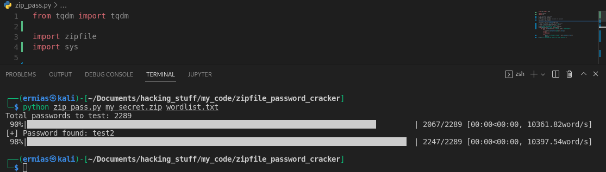

# Brute Force ZIP File Passwords in Python

[live demo](https://vimeo.com/723258767)

### Required:

1. zipfile (built-in module)
2. tqdm

### Install the required dependencies:

`$ pip install tqdm`

### Usage:
`$ python zip_pass.py <ZipFileYouWantToCrack> <Wordlist>`

### Example:
`$ python zip_pass.py my_secret.zip wordlist.txt`

### Screenshot:

### WARNING:

User for learning purpose only!